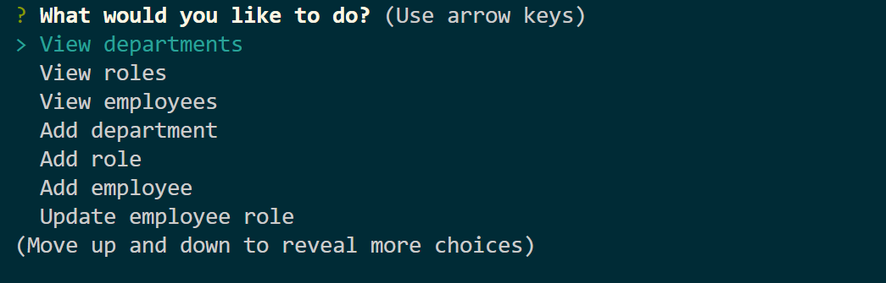
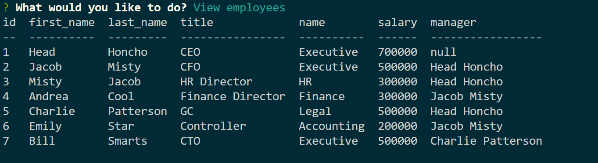

# Employee Manager

## Description

This application is used to manage employees by storing them in a SQL database. Through the this command line application employers are able to:

- Add departments, roles, employees

- View departments, roles, employees

- Update employee roles

This application utilizes the following packages:

- inquirer, to prompt the user with questions to know what actions to take.

- mysql, to query and write to the database.

- console.table, to display the data in a formatted table.

### EE Manager:

Start:

View Employees:

## Table of Contents

- [Installation](#Installation)
- [Usage](#Usage)
- [License](#License)
- [Contributing](#Contributing)
- [Tests](#Tests)
- [Questions](#Questions)

## Installation

To install this application locally clone the repository located at the Github profile in the [Questions](#Questions) section. Additionally, you will need to install the following:

1. [**node.js**](https://nodejs.org/en/)
2. [**Inquirer**](https://www.npmjs.com/package/inquirer)
3. [**mysql**](https://www.npmjs.com/package/mysql)
4. [**console.table**](https://www.npmjs.com/package/console.table)

Once all of these are installed you will be able to use the application from the command line using node.js.

## Usage

In this current release users are only able to:

- Add departments, roles, employees

- View departments, roles, employees

- Update employee roles

## License

## Contributing

This Team Generator was created by [**Jason Richards**](https://github.com/jrkrichards).

## Tests

This release utilize Jest to test the application.

## Questions

Github: https://github.com/jrkrichards
